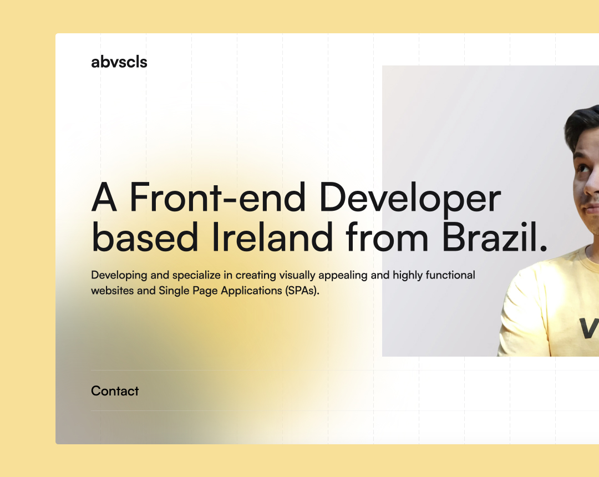

# abvscls.com

[](https://abvscls.com/)

This is the repository of my personal portfolio [abvscls.com](https://abvscls.com/). As a Front-end Engineer, I've amassed a wealth of code over the past few years, showcasing my expertise in cutting-edge technologies such as Vue.js and Nuxt.js. This website serves as a repository for the valuable pieces of code I've crafted throughout my journey in the realm of web development.


# Overview
The front end of the portfolio was made with Vue.js 3, Nuxt.js 3, and TypeScript. It uses libraries such as [GSAP](https://greensock.com/) for animation and other modules from the Vue.js ecosystem to improve User Experience.

# Getting Started
You need to have Node.js and npm installed in your machine, these are our only dependencies to run the project locally.

```sh
# Clone the project.
git clone https://github.com/lekobarros/abvscls.com.git

# Install npm depedencies.
npm install

# Configure .env variables and run the website.
npm start
```
